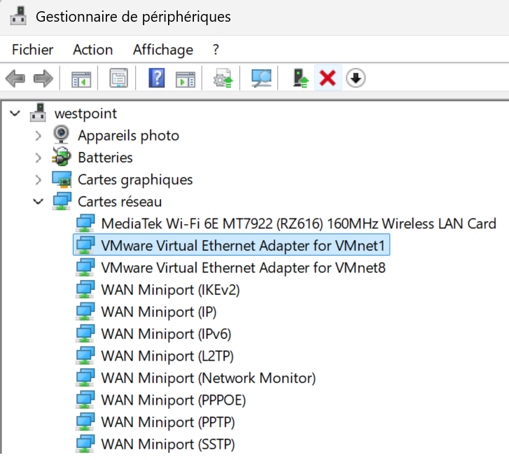
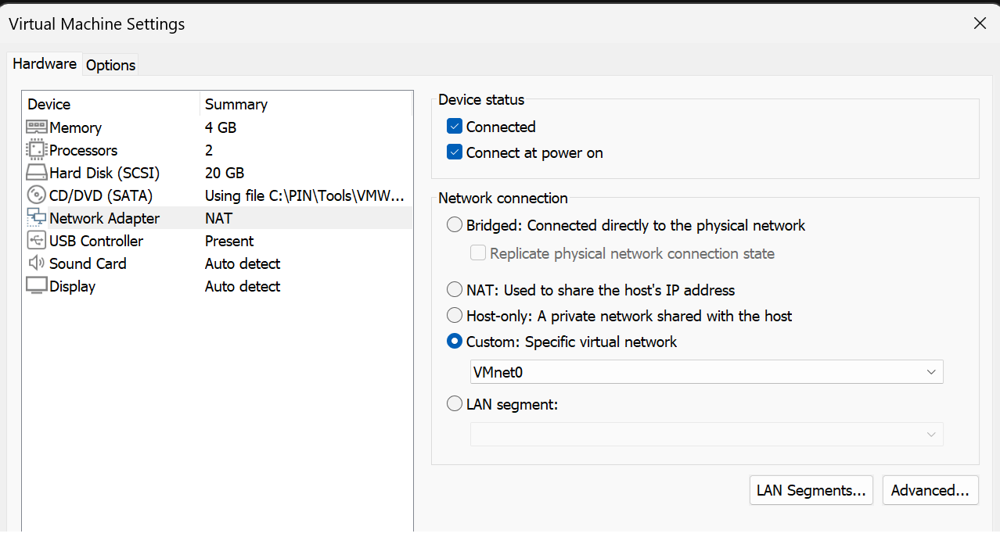
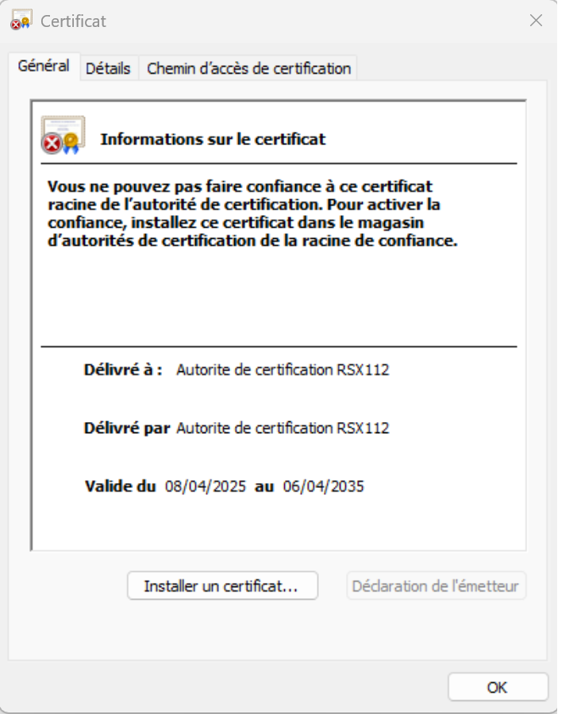
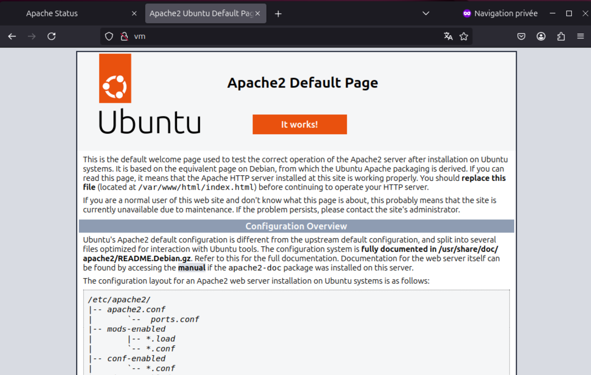
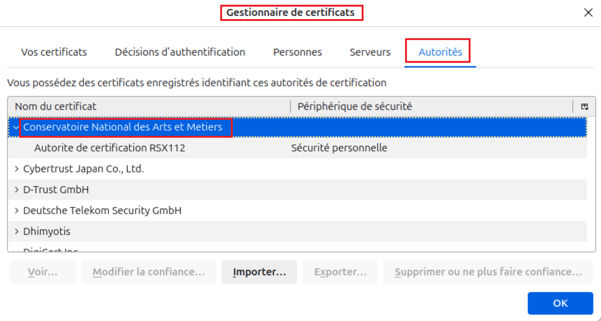
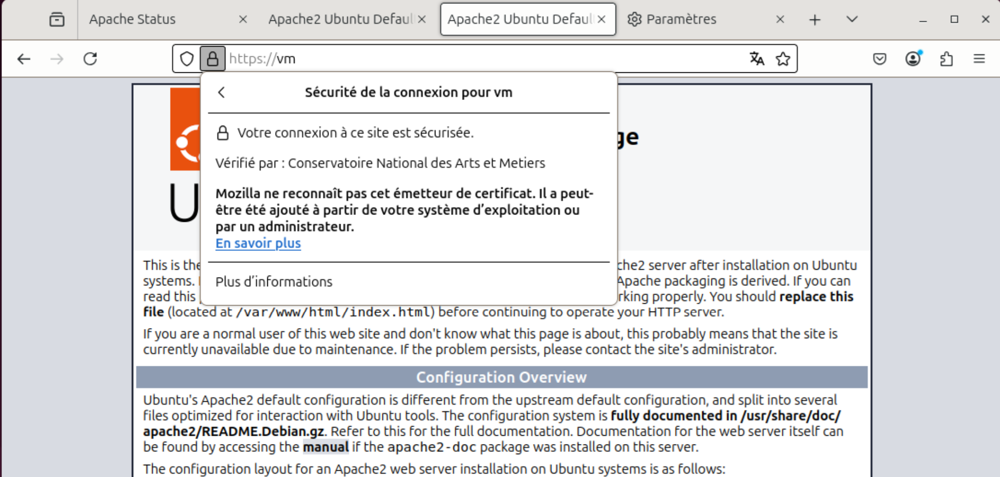
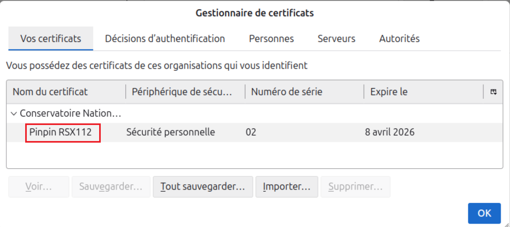

# 17 TP PKI

Choix: déploiement de VM Ubuntu 24.04

VM Image location:
C:\Users\%USERNAME%\OneDrive\Documents\Virtual Machines\Ubuntu 64-bit

## Check Wifi connection

From windows open  and check the VNet Adapter name :


From VMWare Workstation , click on 'your VM name'  / VM settings / Network Adapter / 
<span style="color:red">**/!\ IMPORTANT WARNING: **</span> choose CUSTOM SPECIFIC VNET

```bash
uname -a

sudo vi /etc/network/interfaces 

# then make sure this line is in that file :
# iface eth0 inet dhcp
sudo cat /etc/network/interfaces

sudo apt update
sudo apt upgrade

ifconfig
sudo apt install net-tools -y
sudo apt install vim -y

# ping -c3 -I eth0 www.google.com
ping 8.8.8.8

```


## Install VMWare Tools

Read:
- [https://knowledge.broadcom.com/external/article?legacyId=1014294](https://knowledge.broadcom.com/external/article?legacyId=1014294)
- [https://knowledge.broadcom.com/external/article?legacyId=2073803](https://knowledge.broadcom.com/external/article?legacyId=2073803)
- [https://github.com/vmware/open-vm-tools/blob/master/README.md](https://github.com/vmware/open-vm-tools/blob/master/README.md)

```bash
sudo apt install open-vm-tools-desktop -y

sudo apt install git -y
#git clone https://github.com/vmware/open-vm-tools
#git pull
#git status
#cd open-vm-tools

# strangely the file configure.ac was not pulled
# curl https://raw.githubusercontent.com/vmware/open-vm-tools/refs/heads/master/open-vm-tools/configure.ac

sudo apt install autoconf -y

# configure.ac: warnings
# https://github.com/sshock/AFFLIBv3/issues/47


# autoreconf -i
# ./configure
# udo make install
# sudo ldconfig

# ./configure --enable-servicediscovery
# ./configure --enable-salt-minion
# ./configure --enable-containerinfo=no
# ./configure --enable-containerinfo=yes
# ./configure --help

```
## OpenSSL

- le répertoire ‘ee’ stockera les fichiers des en􀆟tés finales ou ‘End-Entités’
- le répertoire ‘ca’ stockera les fichiers de l’autorité de cer􀆟fica􀆟on. La configura􀆟on par défaut d’OpenSSL nécessite également la créa􀆟on des sous-répertoires suivants : 
    - certs
    - private
    - newcerts
    - crl

```bash
man openssl-x509
openssl version

mkdir -v ~/ee ~/ca ~/ca/certs ~/ca/private ~/ca/newcerts ~/ca/crl
cp -pi /etc/ssl/openssl.cnf ~/ca/
vim ~/ca/openssl.cnf
```

```bash
openssl req -config ~/ca/openssl.cnf -new -x509 -extensions v3_ca -sha256 -newkey rsa:4096 -keyout ~/ca/private/cakey.pem -out ~/ca/cacert.pem -days 3650

# Set CN to: Autorite de certification RSX112

man openssl-req
more ~/ca/private/cakey.pem
openssl rsa -in ~/ca/private/cakey.pem -noout -text
more ~/ca/cacert.pem
openssl x509 -in ~/ca/cacert.pem -noout -text

```
Once you have copied the Root Certificate to Windows :




```bash
echo 01 > ~/ca/serial
touch ~/ca/index.txt

openssl req -config ~/ca/openssl.cnf -new -nodes -sha256 -out ~/ee/web-req.pem -keyout ~/ee/web-key.pem -addext "subjectAltName = DNS:vm"

more ~/ee/web-key.pem
openssl rsa -in ~/ee/web-key.pem -noout -text
more ~/ee/web-req.pem
openssl req -in ~/ee/web-req.pem -noout -text

openssl ca -config ~/ca/openssl.cnf -in ~/ee/web-req.pem -out ~/ee/web-cert.pem
more ~/ca/serial
more ~/ca/index.txt
more ~/ee/web-cert.pem

```

```bash
sudo apt install apache2 -y
systemctl status apache2

sudo apt-get install w3m -y
sudo apachectl status
cat /etc/apache2/mods-enabled/status.conf

# Open Firefox with a private tab at http://127.0.0.1/server-status
sudo netstat -petula | grep 80
sudo netstat -petula | grep apache2
ps -e -o comm,etime,user | grep apache2

sudo vim /etc/hosts
# configure 127.0.0.1 vm
```



```bash
ls -l /etc/apache2/sites-*
sudo cp -pi /etc/apache2/sites-available/default-ssl.conf /etc/apache2/sites-available/default-ssl.orig

sudo vim /etc/apache2/sites-available/default-ssl.conf

# SSLCertificateFile /home/pinpin/ee/web-cert.pem
# SSLCertificateKeyFile /home/pinpin/ee/web-key.pem

sudo a2ensite default-ssl

sudo a2enmod ssl
systemctl reload apache2
systemctl status apache2.service

systemctl restart apache2

```

Once you have imported the RootCA into Firefox:






```bash
sudo apt install wireshark -y
sudo wireshark &


```


```bash
openssl req -config ~/ca/openssl.cnf -new -nodes -newkey rsa:2048 -sha256 -out ~/ee/mail-req.pem -keyout ~/ee/mail-key.pem

more ~/ee/mail-key.pem
more ~/ee/mail-req.pem
openssl req -in ~/ee/mail-req.pem -noout -text

more ~/ca/serial
more ~/ca/index.txt
more ~/ee/mail-cert.pem

openssl pkcs12 -export -in ~/ee/mail-cert.pem -inkey ~/ee/mail-key.pem -certfile ~/ca/cacert.pem -name "RSX112 compte Mail de test" -out ~/ee/mail.p12

```



# Install TinyCA

```bash
sudo apt install tinyca
```

```console
Lecture des listes de paquets... Fait
Construction de l'arbre des dépendances... Fait
Lecture des informations d'état... Fait      
Aucune version du paquet tinyca n'est disponible, mais il existe dans la base
de données. Cela signifie en général que le paquet est manquant, qu'il est devenu obsolète
ou qu'il n'est disponible que sur une autre source

E: Le paquet « tinyca » n'a pas de version susceptible d'être installée

```

```console
xxx
```


```bash
xxx
```

```console
xxx
```


```bash
xxx
```

```console
xxx
```


